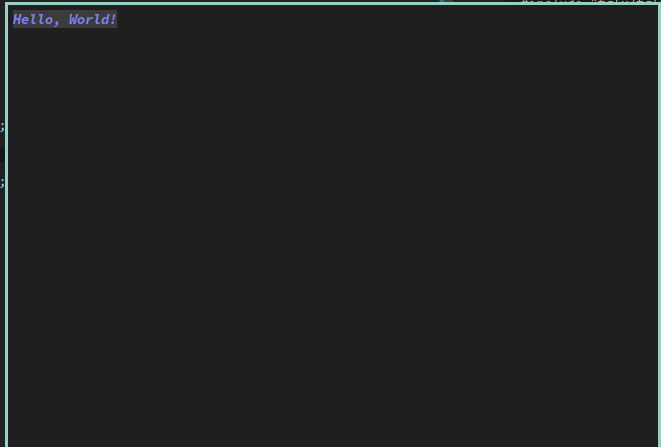
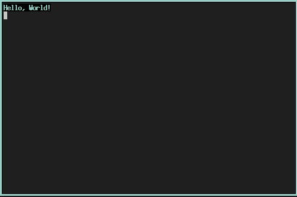

# tgfx

A simple cross-platform terminal graphics library for linux.

* Heavily inspired by [SFML.](https://github.com/SFML/SFML)
* Supports text customization, colorization and styling, with no dependencies.
* Handles 16-color, 256-color, and true color terminals in the back, so you don't have to.
* Use only what you need. (text styling vs. rendering shapes vs. utility objects)

## Note

This repo is a <strong>Work In Progess.</strong> Not all features are implemented.

## Documentation

### [Click here to go to the docs.](https://sarahkittyy.github.io/tgfx)

## Examples

```cpp
#include <iostream>
#include "tgfx/tgfx.hpp"

int main()
{
	// For terminal setup / cleanup.
	tgfx::context ctx;

	tgfx::style style;
	style.bold_on();
	style.italic_on();

	// Blue text
	style.fg_on(tgfx::color(60, 60, 255));
	// Dark grey background
	style.bg_on(tgfx::color(60, 60, 60));

	std::cout << style << "Hello, World!" << std::endl;
	return 0;
}
```

Output (in a true color terminal):



Output (in a 16-color terminal):




## TODO

- [x] Terminal text coloring / styling
- [ ] Terminal cursor movement
- [ ] Drawable primitives